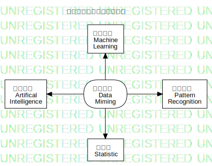
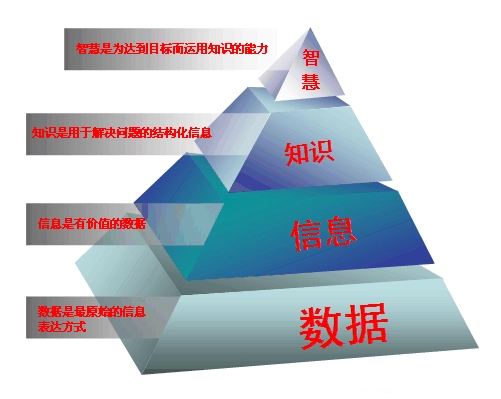

# 数据挖掘，Data Miming

# 数据、信息和知识，Data，Information and Knowledge

[数据](https://baike.baidu.com/item/%E6%95%B0%E6%8D%AE/5947370?fr=aladdin) 是事实或观察的结果，是对客观事物的逻辑归纳，是用于表示客观事物的未经加工的原始素材，数据本身是孤立的、互不关联的客观事实、文字、数字和符号。在计算机科学中，数据有数值、文本、图像、音频等分类；而在统计学中，数据有分类数据、顺序数据和数值数据之分。

[信息](https://baike.baidu.com/item/%E4%BF%A1%E6%81%AF/111163?fr=aladdin) 是对数据进行系统的收集、整理、管理和分析的结果，是经过一系列的提炼、加工和集成后的数据。信息论的创始人香农认为“信息是用来消除随机不确定性的东西”；经济管理学家认为“信息是提供决策的有效数据”。

[知识](https://baike.baidu.com/item/%E7%9F%A5%E8%AF%86/74245#viewPageContent) 就其内容而言，是对客观事物的属性与联系的反映，是客观世界在人脑中的正确反映；就其形式而言，有时表现为主体对事物的感性直觉或表象，属于感性知识，有时表现为关于事物的概念或规律，属于理性知识。

# 商务智能， Business Intelligence

[商务智能](https://baike.baidu.com/item/%E5%95%86%E4%B8%9A%E6%99%BA%E8%83%BD/406141?fromtitle=%E5%95%86%E5%8A%A1%E6%99%BA%E8%83%BD&fromid=9914137&fr=aladdin)，BI，指用现代数据仓库技术（Data Warehousing）、联机分析技术（OLAP）、数据挖掘（Data Miming）和数据展现技术进行数据分析以实现商业价值。

商务智能于 <i>1989</i> （1996？教材第 3 页和第 5 页给出了不同时间，此处有待查证）年由美国加特纳公司（Gartner Group）的分析师 Howard Dresner 提出，是数据挖掘与企业管理结合的产物，对于其概念的定义，企业界和学术界如 IBM，Business Object，Microsoft，IDC，Oracle 和 Data Warehouse Institute 都有比较全面的定义。  
商务智能专家王茁给出了如下定义：

> 商务智能是企业利用现代信息技术收集、管理和分析结构化或非结构化的商务数据和信息，创造和积累商务知识和见解，改善商务决策水平，采取有效的商务活动，完善各种商务流程，提升各方面商务绩效，增强综合竞争力的智慧和能力。

其特点：

1. 服务企业战略

   BI 能够对企业的内外部数据进行分析，支持企业战略管理。

2. 提升企业绩效

   BI 更多地是用来解决管理问题，通过 BI 能从企业多年的运营数据中挖掘有效的模式辅助管理决策。

3. “数据练油厂”

   BI 根据业务需要收集数据，并进行提炼和加工，最终产生对企业有价值的知识，提高企业的绩效。

4. 多项技术的综合应用

   BI 从不同的数据源中提取有用的数据，通过数据仓库，联机分析处理和数据挖掘等技术实现企业的决策、考核、分析有机结合和量化以达到为企业提供经营管理、决策支持的目的。

5. 用户的多样性

   BI 服务于各类企业决策者，包括一线业务人员、各级管理者，甚至外部的顾客和商业伙伴。

-----

本课程将会使用的应用软件

[WEKA](https://www.cs.waikato.ac.nz/ml/weka/index.html) 是可靠的和经过测试的开源机器学习软件，可以用于 GUI，标准的终端应用程序，或者 Java API。它被广泛用于教学、研究和工业生产，包含大量内建的标准机器学习任务工具，也透明地提供知名的工具箱，如 [scikit-learn](https://markahall.blogspot.co.nz/2015/06/cpython-integration-in-weka.html) ，[R](https://markahall.blogspot.com/2012/07/r-integration-in-weka.html)  ，和 [Deeplearning4j](https://deeplearning.cms.waikato.ac.nz/) 。

与本课程相关的知名会议

[PACIS](https://www.pacis2021.org/) 是亚太地区首要的信息系统会议并且自 1993 年成立便隶属于 [AIS](https://aisnet.org/)。每年来自全世界的信息系统学者聚此讨论领先的研究和发展。由于新冠病毒， [PACIS 2021](https://www.pacis2021.org/) 仍然是虚拟会议，并安排于 2021 年 6月 22-24 日迪拜城市。

[ICIS](https://icis2020.aisconferences.org/) 是 [AIS](https://aisnet.org/) 会议。

