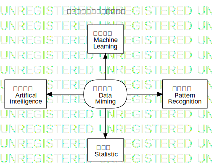

# 数据挖掘，Data Miming

与本课程相关的知名会议：

[PACIS](https://www.pacis2021.org/) 是亚太地区首要的信息系统会议并且自 1993 年成立便隶属于 [AIS](https://aisnet.org/)。每年来自全世界的信息系统学者聚此讨论领先的研究和发展。由于新冠病毒， [PACIS 2021](https://www.pacis2021.org/) 仍然是虚拟会议，并安排于 2021 年 6月 22-24 日迪拜城市。

[ICIS](https://icis2020.aisconferences.org/) 是 [AIS](https://aisnet.org/) 会议。

# 商务智能， Business Intelligence

[商务智能](https://baike.baidu.com/item/%E5%95%86%E4%B8%9A%E6%99%BA%E8%83%BD/406141?fromtitle=%E5%95%86%E5%8A%A1%E6%99%BA%E8%83%BD&fromid=9914137&fr=aladdin)，BI，指用现代数据仓库技术（Data Warehousing）、联机分析技术（OLAP）、数据挖掘（Data Miming）和数据展现技术进行数据分析以实现商业价值。

商务智能于 1996 年由 Gartner Group 提出，是数据挖掘与企业管理结合的产物。

其特点：

1. 服务企业战略
2. 提升企业绩效
3. “数据练油厂”
4. 多项技术的综合应用
5. 用户的多样性

-----

[数据](https://baike.baidu.com/item/%E6%95%B0%E6%8D%AE/5947370?fr=aladdin) 是事实或观察的结果，是对客观事物的逻辑归纳，是用于表示客观事物的未经加工的原始素材。在统计学中，数据有分类数据、顺序数据和数值数据之分。

[信息](https://baike.baidu.com/item/%E4%BF%A1%E6%81%AF/111163?fr=aladdin) 是用来消除随机不确定性的东西；是提供决策的有效数据。

[知识](https://baike.baidu.com/item/%E7%9F%A5%E8%AF%86/74245#viewPageContent) ？？？

[WEKA](https://www.cs.waikato.ac.nz/ml/weka/index.html) 是可靠的和经过测试的开源机器学习软件，可以用于 GUI，标准的终端应用程序，或者 Java API。它被广泛用于教学，研究和工业生产，包含大量内建的标准机器学习任务工具，也透明地提供知名的工具箱，如 [scikit-learn](https://markahall.blogspot.co.nz/2015/06/cpython-integration-in-weka.html) ，[R](https://markahall.blogspot.com/2012/07/r-integration-in-weka.html)  ，和 [Deeplearning4j](https://deeplearning.cms.waikato.ac.nz/) 。

