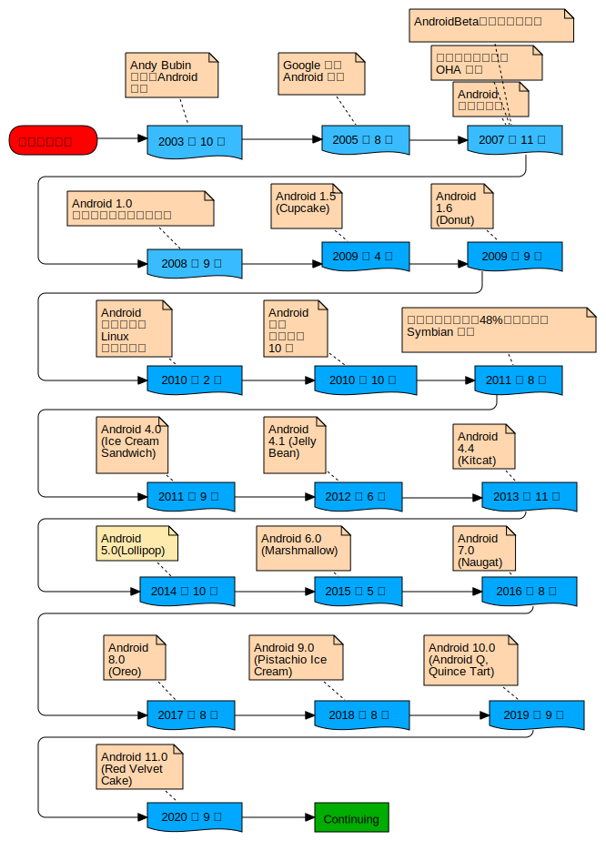

# Android 概述

> 编者按：此部分内容是编者为了解 Android 系统加的

安卓是一种基于 Linux 内核的自由及开放源代码的操作系统。主要使用于移动设备，如智能手机和平板电脑。

发展历程[^发展历程]

*图解：*  

*文字描述：*  
2003 年 10 月， 安迪-鲁宾（Andy Rubin）等人创建 Android 公司，并组建 Android 团队；

2005 年 8 月 17 日， Google 低调收购了成立仅 22 个月的高科技企业 Android 及其团队。Andy Bubin 成为 Google 公司工程部副总裁，继续负责 Android 项目；

2007 年 11 月 5 日， Google 公司正式向外界展示了这款名为 Android 的操作系统，并且在这天宣布建立一个全球性的联盟组织，该组织由 34 家手机制造商、软件开发商、电信运营商以及芯片制造商共同组成，并与 84 家硬件制造商、软件开发商及电信运营商组成开放手持设备联盟（OHA，Open Handset Alliance）来共同研发改良 Android 系统，这一联盟将支持 Google 发布的手机操作系统以及应用软件， Google 以 Apache 免费开源许可证的授权方式，发布了 Android 的源代码。

2008 年，在 Google I/O 大会上，Google 提出了 AndroidHAL 架构图，在同年 8 月 18 号， Android 获得了美国联邦通信委员会（FCC）的批准，在 2008 年 9 月，Google 正式发布了 Android 1.0 系统，这也是 Android 系统最早的版本；

2009 年 4 月，Google 正式推出了 Android 1.5 这款手机，从 Android 1.5 版本开始，Google 开始将 Android 的版本以甜品的名字命名，Android 1.5 命名为 Cupcake （纸杯蛋糕）。该系统与 Android 1.0 相比有了很大的改进；

2009 年 9 月，Google 发布了 Android 1.6 的正式版，并且推出了搭载 Android 1.6 正式版的手机 HTC Hero（G3），凭借着出色的外观设计以及全新的 Android 1.6 操作系统，HTC Hero（G3）成为当时全球最受欢迎的手机。Android 1.6 也有一个有趣的甜品名称，它被称为 Donut（甜甜圈）；

2010 年 2 月，Linux 内核开发者 Greg KroahHartman 将 Android 的驱动程序从 Linux 内核“状态树（staging tree）”上除去，从此，Android 与 Linux 开发主流分道扬镳。在同年 5 月份， Google 正式发布 Android 2.2 操作系统。Google 将 Android 2.2 操作系统命名为 Froyo （冻酸奶）；

2010 年 10 月，Google 宣布 Android 系统达到了第一个里程碑，即电子市场上获得官方数字认证的 Android 应用数量已经达到了 10 万个， Android 系统的应用增长非常迅速。在 2010 年 12 月， Google正式发布 Android 2.3 操作系统 Gingerbread（姜饼）；

2011 年 1 月，Google 称每日的 Android 设备新用户数量达到了 30 万，到2011 年 7 月，这个数字增长到 55 万，而 Android 系统的用户总数达到了 1.35 亿，Android 系统已经成为智能手机领域占有量最高的系统；

2011 年 8 月 2 日，Android 手机已占据全球智能手机市场 48% 的份额，并在亚太地区占据统治地位，终结了 Symbian 的霸主地位，跃居全球第一；

2011 年 9 月，Android 系统的应用数目已经达到了 48 万，而在智能手机市场， Android 系统的占有率已经达到了 43%，继续排在移动操作系统首位。Google 发布的全新的 Android 4.0 系统，被命名为 Ice Cream Sandwich（冰激凌三明治）；

2012 年 1 月 6 日，Google Android Market 已有 10 万开发者推出超过40万活跃的应用，大多数的应用程序为免费。Android Market 应用程序商店目录在新年首周周末突破 40 万基准，距离突破30万应用仅用4个月。在2011年早些时候，Android Market 从20万增加到30万应用也花了4个月；

2013年11月1日，Android 4.4  （Kitcat，奇巧）正式发布，从具体功能上讲，Android 4.4 提供了各种实用小功能，新的 Android 系统更智能，添加更多的 Emojji 表情图案， UI 改进也更现代，如全新的 Hello iOS7半透明效果。

2015 年，网络安全公司 Zimperium 研究人员警告，Android 存在“致命”安全漏洞，黑客发送一封彩信便能在用户毫不知情的情况下完全控制手机；

2018 年 10 月，Google 表示，于2018年12月6日停止 Android 系统中的 Nearby Notifications服务，因为 Android 用户收到太多附近商家推销信息的垃圾邮件；

2020年3月，Google 的 Android 安全公告中提到，新更新已经提供了 CVE-2020-0069 补丁来解决针对联发科芯片的一个严重漏洞。 

# 移动互联网

移动互联网是 PC 互联网发展的必然产物，是将移动通信终端和互联网融为一体，用户使用手机、平板、PDA或其他无线终端设备通过速率较高的移动网络，在移动状态下，随时随地访问互联网以获取信息，使用商务、娱乐等各种网络服务。移动互联网具有 PC 互联网开放，协作与移动网的实时性，隐私性，便捷性，准确性和可定位等特点。

[移动互联网](https://baike.baidu.com/item/%E7%A7%BB%E5%8A%A8%E4%BA%92%E8%81%94%E7%BD%91/7837035?fr=aladdin) 的发展历程

1. 移动增值网
2. 独立 WAP 网站
3. 宽带互联网
4. 移动互联网

# 移动应用开发

[三种移动APP（应用程序）开发方式比较](https://blog.csdn.net/qq_35010958/article/details/51423549)

三种移动应用开发方式

| 开发方式   | 简单描述                                                     | 优缺点                                                       |
| ---------- | ------------------------------------------------------------ | ------------------------------------------------------------ |
| Native APP | 原生程序，依托操作系统                                       | 能够使用硬件设备的底层功能，速度更快、性能高，可离线使用 开发成本高，使用不同的语言，维护成本高，支持设备有限，内容限制 |
| Web APP    | HTML5 开发的应用，轻应用                                     | 跨平台开发，开发速度快，支持设备广泛，用户不需要下载安装 用户体验差，数据获取受网络通堵影响，需要在推广上投入时间精力 |
| Hybrid APP | 半原生，半 Web 的混合类应用，有三种方案：Web架构为重，编译转换方式，Native架构为重 |                                                              |

# Android 与 Linux 的区别

[图解Android和Linux发行版的区别](https://blog.csdn.net/qq_26093511/article/details/88836221)

Android 开源系统（AOSP, Android Open Source Project）提供了 Android 系统的框架，包括 Android 专用的 Linux 内核，Dalvik 虚拟机[^Dalvik]（后改为Android Runtime，ART）和 Android 应用层框架。  
Dalvik 虚拟机是 Google 开发的运行 apk 程序的 JVM。Android 系统的 init 进程只允许一个 Dalvik 或 ART 子进程；而 Linux 发行版中可以存在多个 Dalvik 或 ART 子进程。

[^发展历程]: 来自百度百科：[Android（美国谷歌公司开发的移动操作系统）](https://baike.baidu.com/item/Android/60243?fr=aladdin)
[^Dalvik]: [喜闻乐见-Android简介](https://my.oschina.net/u/4274157/blog/3805924)