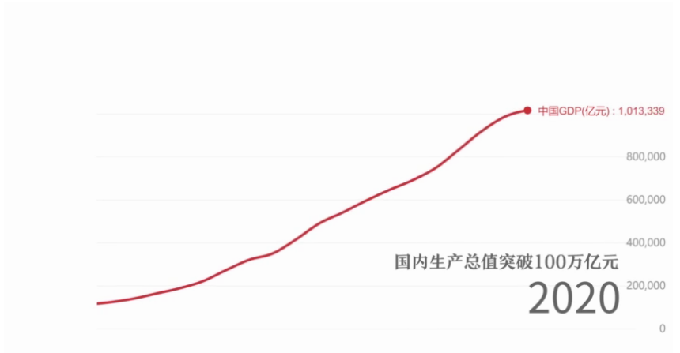
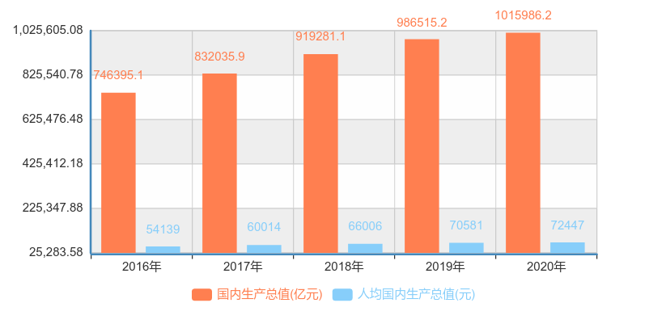

# 决胜全面小康，共襄复兴伟业

## 一、全面建成小康社会的丰富内涵和要求

在 20 世纪末，我国已经达到总体小康的水平，但是实现的总体小康是低水平（经济总量已达到一定规模，但人均水平还比较低）、不全面（满足生存性消费，发展性消费没有得到有效满足；经济得以发展，而社会保障等方面有待提高）和发展不平衡（地区之间、城乡之间和居民之间发展水平差距不小）的小康

<strong>实现“小康”是中华民族的千年梦想</strong>

相关链接：[全面小康 全面解码——千年梦圆](https://w.yangshipin.cn/video?type=0&vid=c000008pjrl)

党的十八大以来，我们党顺应我国经济社会新发展和广大人民群众新期待，赋予了“小康”更高的标准、更丰富的内涵。

<strong>全面小康社会具有丰富的内涵和要求</strong>

全面小康是五位一体全面进步的小康，要求经济持续健康发展、人民民主不断扩大、文化软实力显著增强、人民生活水平全面提高和两型社会建设取得重大进展

全面小康是惠及全体人民的小康，真正实现“发展为了人民、发展依靠人民，发展成果由人民共享[^人民]”

全面小康是城乡区域共同发展的小康，全面建成小康社会的一项重要任务就是努力缩小城乡区域发展差距，统筹城乡发展，统筹区域发展，推进城乡发展一体化。

## 二、全面建成小康社会取得的决定性进展

1. 经济实现高质量发展
2. 发展协调性明显增强
3. 人民生活水平和质量普遍提高
4. 国民素质和社会文明程度显著提高
5. 生态环境质量总体改善
6. 各方面制度更加成熟更加定型

<strong>决胜全面建成小康社会取得决定性成就 </strong>

参考：[《中共中央关于制定国民经济和社会发展第十四个五年规划和二〇三五年远景目标的建议》](http://www.gov.cn/zhengce/2020-11/03/content_5556991.htm) 和 [“十三五”时期决胜全面建成小康社会取得了哪些决定性成就？](http://www.12371.cn/2020/11/13/VIDE1605261301920576.shtml)

> 第一，“全面深化改革取得重大突破，全面依法治国取得重大进展，全面从严治党取得重大成果，国家治理体系和治理能力现代化加快推进，中国共产党领导和我国社会主义制度优势进一步彰显”。这主要是从“四个全面”战略布局角度来总结的。“十三五”时期，我们党统筹推进“五位一体”  总体布局，协调推进“四个全面”战略布局，全面深化改革全面发力、蹄疾步稳，全面依法治国全面加强、全面推进，全面从严治党力度不减、纵深推进，中国特色社会主义制度更加完善，国家治理体系和治理能力现代化水平明显提高，党的领导和党的建设全面加强，为全面建成小康社会提供了根本动力、制度保障和政治保证。
>
> 　　第二，“经济实力、科技实力、综合国力跃上新的大台阶，经济运行总体平稳，经济结构持续优化，预计二〇二〇年国内生产总值突破一百万亿元”。这是全面建成小康社会最主要的标志。2020年虽然遭遇新冠肺炎疫情严重冲击，但我国率先控制住疫情，率先实现复工复产，率先实现经济正增长，完全能够实现年初确定的目标任务，确保“十三五”规划圆满收官，全面建成小康社会。
>
> 　　第三，“脱贫攻坚成果举世瞩目，五千五百七十五万农村贫困人口实现脱贫”。打赢脱贫攻坚战是全面建成小康社会的重中之重，既决定着全面小康社会的质量和成色，也决定着全面小康能否经得起历史和人民的检验。2020年以来，面对新冠肺炎疫情的严重冲击，党中央及时召开决战决胜脱贫攻坚座谈会，继续聚焦“三区三州”等深度贫困地区，瞄准突出问题和薄弱环节狠抓政策落实，对52个未摘帽贫困县和1113个贫困村实施挂牌督战，因地制宜落实分区分级精准防控策略，优先支持贫困劳动力务工就业和扶贫产业恢复生产，有力推动扶贫项目开工复工，有效确保了脱贫攻坚任务如期完成。
>
> 　　第四，“粮食年产量连续五年稳定在一万三千亿斤以上”。粮食安全事关国计民生和社会稳定。“十三五”时期，我们党和国家始终把“三农”问题摆在首位，加快推进农业农村现代化，粮食生产能力不断提高，有力确保了中国人的饭碗始终牢牢端在中国人手上、饭碗里始终装着中国自己生产的粮食。
>
> 　　第五，“污染防治力度加大，生态环境明显改善”。“十三五”时期，党和国家一以贯之践行绿水青山就是金山银山的理念，以最坚定的决心、最严格的制度、最有力的举措，持续以水、大气、土壤污染治理为重点实施污染防治攻坚战，推动我国生态环境保护发生历史性、转折性、全局性变化，为全球生态治理作出了积极贡献。
>
> 　　第六，“对外开放持续扩大，共建‘一带一路’成果丰硕”。“十三五”时期，党和国家坚定不移扩大对外开放，以“一带一路”  建设、自由贸易试验区和自由贸易港建设为突破口，推动形成了陆海内外联动、东西双向互济的全方位对外开放新格局，为全面建成小康社会创造了新机遇、提供了新动力。
>
> 　　第七，“人民生活水平显著提高，高等教育进入普及化阶段，城镇新增就业超过六千万人，建成世界上规模最大的社会保障体系，基本医疗保险覆盖超过十三亿人，基本养老保险覆盖近十亿人，新冠肺炎疫情防控取得重大战略成果”。这是全面建成小康社会中最有说服力的指标，极大增强了14亿中国人民的获得感、幸福感、安全感。
>
> 　　第八，“文化事业和文化产业繁荣发展”。“十三五”时期，党对意识形态工作的领导明显加强，意识形态工作责任制得到全面落实，马克思主义在意识形态领域指导地位更加鲜明，中国特色社会主义和中国梦深入人心，社会主义核心价值观得到广泛弘扬，全党全社会思想上的团结统一更加巩固。
>
> 　　第九，“国防和军队建设水平大幅提升，军队组织形态实现重大变革”。“十三五”时期，党和国家坚持政治建军、改革强军、科技强军、人才强军、依法治军，以前所未有的力度推进国防和军队现代化建设，着力推进领导指挥体制改革，着力推进规模结构和力量编成改革，推进军队组织形态现代化，着力推进军事政策制度改革，深入解决制约国防和军队建设的体制性障碍、结构性矛盾、政策性问题，开创了强军兴军新局面。
>
> 　　第十，“国家安全全面加强，社会保持和谐稳定”。“十三五”时期，面对错综复杂的国际形势和艰巨繁重的国内改革发展稳定任务，党和国家坚持总体国家安全观，统筹发展和安全，着力完善国家安全体系，着力推进各重点领域国家安全政策落地落实，着力防范化解各类风险挑战，国家安全能力不断提高。坚持完善党委领导、政府负责、民主协商、社会协同、公众参与、法治保障、科技支撑的社会治理体系，着力建设人人有责、人人尽责、人人享有的社会治理共同体，实现了社会大局和谐稳定，我国成为世界上最有安全感的国家之一。

[小红线，向上攀！](https://mp.weixin.qq.com/s/RgF7Ctth_1YI-EjfxAeOAg)  

十三五时期 GDP 与人均 GDP[^GDP数据来源]  

***全面建成小康社会是实现中华民族伟大复兴的应有之义、必经阶段和重要基础，在实现中华民族伟大复兴中国梦的历史进程中具有承上启下的重大意义。新征程上，我们要以坚如磐石的信念、坚韧不拔的毅力，为实现中华民族伟大复兴的中国梦接续奋斗。***

----

<strong>补充</strong>  
[两不愁，三保障](https://baike.baidu.com/item/%E4%B8%A4%E4%B8%8D%E6%84%81%E4%B8%89%E4%BF%9D%E9%9A%9C/23151980?fr=aladdin) “两不愁”就是稳定实现农村贫困人口不愁吃、不愁穿；“三保障”就是保障其义务教育、基本医疗和住房安全，是农村贫困人口脱贫的基本要求和核心指标。  
[三大攻坚战](https://baike.baidu.com/item/%E4%B8%89%E5%A4%A7%E6%94%BB%E5%9D%9A%E6%88%98/22414205?fr=aladdin) 三大攻坚战[^三大攻坚战]是指防范化解重大风险、精准脱贫[^脱贫攻坚战]、污染防治，是在十九大报告中首次提出的新表述。  
[两个一百年](https://baike.baidu.com/item/%E4%B8%A4%E4%B8%AA%E4%B8%80%E7%99%BE%E5%B9%B4/4272808?fr=aladdin) 在中国共产党成立一百年时全面建成小康社会；新中国成立一百年时建成富强民主文明和谐的社会主义现代化国家[^两个一百年]（十八大报告）。

[^人民]: 出自《中国共产党党章》总纲。《中共中央关于制定国民经济和社会发展第十四个五年规划和二〇三五年远景目标的建议》中有“坚持人民主体地位，坚持共同富裕方向，始终做到发展为了人民、发展依靠人民、发展成果由人民共享，维护人民根本利益，激发全体人民积极性、主动性、创造性，促进社会公平，增进民生福祉，不断实现人民对美好生活的向往”

[^GDP数据来源]: 见[同国家数据](https://data.stats.gov.cn/easyquery.htm?cn=C01)，补充：1 USD=6.5032 CNY    1 CNY ≈ 0.1538 USD
[^脱贫攻坚战]: 2021 年 2 月 25 日，全国脱贫攻坚战总结表彰大会在京隆重举行，习近平庄严宣告：我国脱贫攻坚战取得了全面胜利
[^三大攻坚战]: 2021年3月5日，政府工作报告2020年三大攻坚战主要目标任务如期完成。
[^两个一百年]: 党的十九大报告对两个一百年补充和完善：从二〇二〇年到本世纪中叶可以分两个阶段来安排。第一个阶段，从二〇二〇年到二〇三五年，在全面建成小康社会的基础上，再奋斗十五年，基本实现社会主义现代化。第二个阶段，从二〇三五年到本世纪中叶，在基本实现现代化的基础上，再奋斗十五年，把我国建成富强民主文明和谐美丽的社会主义现代化强国