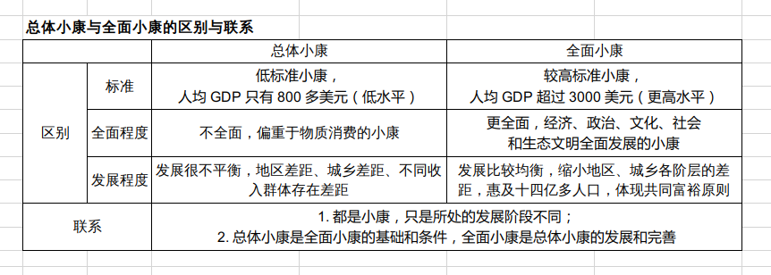
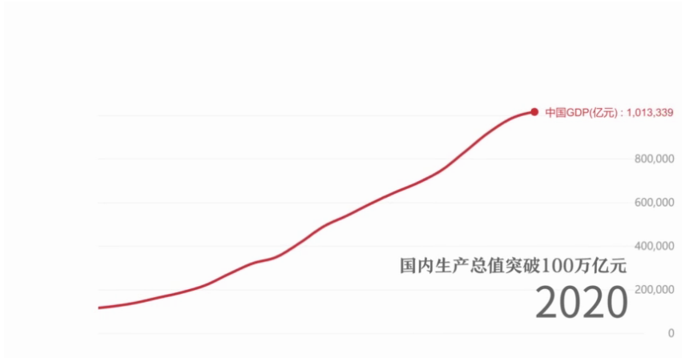
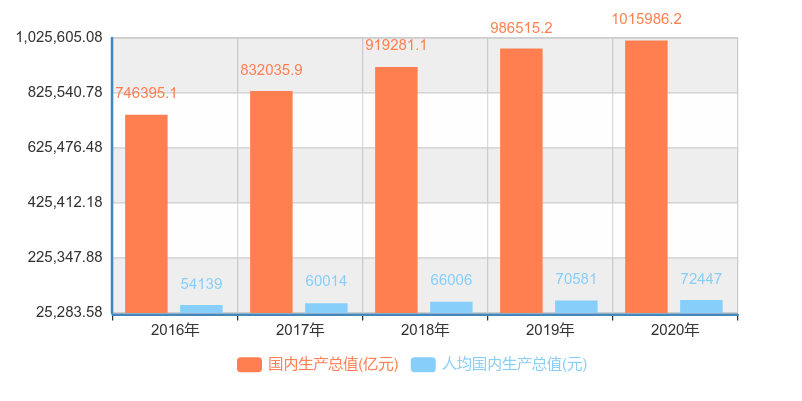

# 坚持“一国两制”事业初心

## 三、坚决筑牢“一国两制”根基

[筑牢香港安全“防波堤”](https://tv.cctv.com/2020/07/03/VIDEb68GZoEwH8dpYwpwPikX200703.shtml?spm=C45404.PhRThW8bw020.EToagw7mjlwm.152)

> **央视网消息**（焦点访谈）：香港回归祖国23周年纪念日前夕（按：2020 年 6 月 30 日），《中华人民共和国香港特别行政区维护国家安全法》获得通过并颁布实施，开启了香港“一国两制”实践的新征程。香港国安法被认为是香港繁荣稳定的“守护神”和“定海神针”。那么，它依据的法理基础是什么？它的实施如何堵住香港维护国家安全的漏洞？它有哪些打击、威慑危害国家安全行为的法律武器呢？ 
>
> 7月1日国务院新闻办举行的新闻发布会上，国务院港澳事务办公室副主任张晓明表示：一法可安香江[^香江]。香港国安法是继香港基本法[^香港基本法]之后，中央为香港特别行政区专门制定的第二部重要法律。他把香港国安法比喻为香港繁荣稳定的“守护神”和“定海神针”。
>
> 《香港特别行政区维护国家安全法》有6章，分别为：总则，香港特别行政区维护国家安全的职责和机构，罪行和处罚，案件管辖、法律适用和程序，中央人民政府驻香港特别行政区维护国家安全机构，附则，共66条。是*一部兼具实体法、程序法和组织法内容的综合性法律*。
>
> 国务院港澳事务办公室副主任邓中华说：“为什么要把这三个方面的内容都包含在一部法律里面，这也是经过慎重的考虑的，一个是根据全国人大的决定，同时考虑到香港的特殊性。只有这样才能够使维护国家安全的整个制度变成一个有效的制度。”
>
> 制定香港国安法，目的就是要堵塞法律上的漏洞，补齐香港维护国家安全机制上的短板，改变香港在国家安全方面长期“不设防”的状态。维护国家安全法律漏洞的存在，已经使香港的社会付出了惨痛代价。
>
> 清华大学港澳研究中心主任王振民说：“*关键香港是全世界唯一一个没有健全的维护国家安全的法律制度和执行机制的地方[^维护国家安全]。*”
>
> 全国人大常委会香港特别行政区基本法委员会委员、中国人民大学法学院教授韩大元说：“从去年6月份修例到现在，法治受损害，营商环境受损害，包括投资者在内的外国人。加强了国家安全，不仅仅是主权国家的利益，也符合投资者的利益。”
>
> 有人说，香港实行的是“一国两制”、“港人治港”、高度自治，中央来制定香港国安法，其法理基础在哪里？会不会与“港人治港”、高度自治有冲突？香港国安法第三条明确了这部法律的法理出发点，因为第三条[^第三条]明确了两个责任，就是中央人民政府对香港特别行政区有关的国家安全事务负有根本责任，香港特别行政区负有维护国家安全的宪制责任，应当履行维护国家安全的职责。
>
> 清华大学港澳研究中心主任王振民说：“根本责任有三个含义，第一个含义它是固有的责任，是原始的、初始的、固有的责任；第二个它是全面的责任；第三个它是最高的责任，有关国家安全的事务到了中央层面就是要做最终决策的责任，特别行政区这个法律里用的是宪制责任，宪制责任和国家的根本责任有区别。中央是全面的，中央授权你干什么你就干什么，没有授权的你就没有；另外这个责任要服从中央的最高责任。”
>
> 法律是治国之重器。香港国安法有哪些打击危害国家安全的法律武器？在香港国安法第三章中，明确规定了防范、制止和惩治四类危害国家安全的罪行，包括**分裂国家罪**、**颠覆国家政权罪**、**恐怖活动罪**和**勾结外国或境外势力危害国家安全罪**这四类犯罪行为的构成及其应当承担的法律责任。触犯这四类罪，最高可判处无期徒刑。
>
> 清华大学港澳研究中心主任王振民说：“去年在香港发生了很多令人震惊的恐怖事件，极大影响到了香港社会的安宁。还有这些年，外国和境外势力在香港肆无忌惮。“港独”的背后，极端势力的背后，都有这些外国势力的支持。这四种情况，四种行为，就是目前香港面临的最突出的现象，立法要解决这些问题。”
>
> 国务院港澳事务办公室副主任邓中华说：“我们国家刑法第二编第一章对危害国家安全罪规定了十几项，但是本法仅对四种罪行，其目的就是要重点打击当前在香港发生的危害国家安全行为。5月28日全国人民代表大会决定，给全国人大常委会授权，不是一次性的授权，以后全国人大常委会可以根据香港实际情况，继续制定相关法律，可以继续就危害国家安全有关行为定罪量刑。”
>
> 除了法律制度，香港国安法还从中央和特别行政区两个层面明确规定了香港维护国家安全的执行机制。包括香港特别行政区设立维护国家安全委员会，香港特别行政区政府警务处设立维护国家安全的部门，配备执法力量。香港特别行政区政府律政司设立专门的国家安全犯罪案件检控部门，负责危害国家安全犯罪案件的检控工作和其他相关法律事务，并且明确规定了这些新成立机构的具体职责与活动的准则。香港特别行政区行政长官指定若干名法官，负责处理危害国家安全犯罪案件。特别是中央人民政府在香港特别行政区设立维护国家安全公署，依法履行维护国家安全职责，行使相关权力。
>
> 王振民说：“香港去年‘修例风波’出这么大的事情，它不仅是缺立法，更缺的是执法和执行，这也是对症下药，这部法非常强调执行机制的重要原因。徒法不足以自行，仅仅靠法律，法律自己不会执行自己，必须要有配套的、完善的执行体制机制。法律的生命就在于执行，没有执行的法律，没有执行机制的法律是苍白无力的法律。”
>
> 在案件管辖上，香港国安法明确规定<u>由香港处理绝大多数危害国家安全的案子，只保留极少数严重危害国家安全的案子由中央处理</u>。
>
> 邓中华说：“首先，中央管辖的案件仅仅是本法规定的四类犯罪案件，在香港危害国家安全的行为有很多，也有很多法律做出规定，中央在港机构仅仅对本法规定的四种犯罪行为进行管辖；第二，即便在这四种犯罪行为当中，中央也不是都管，也是管极少的，大部分案件都让特区相关机构去管辖。”
>
> 王振民说：“这样就把大量的管辖权、维护国家安全的案件授权给香港特区，它来负责办理，这是对特区高度自治的尊重，也是对它的信任。不是说不信任特区，恰恰是信任特区的表现，中央可以办，但是没有办，交给你来办，这不是信任是什么？”
>
> 由驻港国安公署行使管辖权的极少数严重危害国家安全的案子，香港国安法也有明确的规定。只能在三种情形下行使管辖权：（一）案件涉及外国或者境外势力介入的复杂情况，香港特别行政区管辖确有困难的；（二）出现香港特别行政区政府无法有效执行本法的严重情况的；（三）出现国家安全面临重大现实威胁的情况的。
>
> 王振民说：“主要是有一些案件特区根本就没有权力管的案子，比如涉及到外交，特区法院对外交、国防就没有管辖权，基本法已经明确规定；另外就是有一些案件，国家安全案件都是极其复杂的，因素很多，特区可能管不了，不是说它不想管，是管不了，越复杂、越困难说明案件可能案情越重大，在这种情况下中央应该把这个案子接起来。”
>
> 依据香港国安法，香港特别行政区管辖危害国家安全犯罪案件的立案侦查、检控、审判和刑罚的执行等诉讼程序事宜，适用香港国安法和香港特别行政区本地法律。驻港国安公署行使管辖权的案件，由驻港国安公署负责立案侦查，最高人民检察院指定有关检察机关行使检察权，最高人民法院指定有关法院行使审判权。案件的立案侦查、审查起诉、审判和刑罚的执行等诉讼程序事宜，适用《中华人民共和国刑事诉讼法》等相关法律的规定。驻港国安公署行使管辖权，必须经香港特别行政区政府或者驻港国安公署提出，并报中央人民政府批准。
>
> 专家指出，香港国安法的实施，不仅意味着香港特别行政区拥有的高度自治权力没有减弱，反而是增强。
>
> 清华大学港澳研究中心主任王振民说：“维护国家安全那么多授权，是现在基本法里没有的。通过人大的决定和立法，又增加了对特区的授权，特区的职责范围、权限范围扩大了，这些方面高度自治不仅没有受到影响，反而是巩固了特区的高度自治。”
>
> 邓中华说：“香港自从回归祖国之日起就重新纳入到国家的治理体系。这部法律的颁布和实施具有重大的现实意义和深远的历史意义，它既能为在香港特别行政区有效地维护国家安全提供制度和机制保障，又能切实推进中央对香港全面管治权的落实。” 
>
> 法律是治国之重器，良法是善治之前提。香港国安法的公布实施，对实施危害国家安全行为的极少数人而言是高悬利剑，对于遵纪守法的香港广大居民来说是有力保障。目前，香港维护国家安全的新机构正在陆续成立。香港将重返正轨，“一国两制”将行稳致远，香港将会以更安全、稳定、和谐的社会环境和良好的营商环境吸引外来投资者，继续保持国际金融、贸易、航运中心的地位。风雨过后，“东方之珠”[^东方之珠]将更加灿烂。

<strong>香港国安法的出台的意义</strong>

1. 确保“一国两制”行稳致远的治本之策

   香港国安法是“一国两制”事业的重要里程碑，是中央完善治港方略的新标志，是香港繁荣稳定的“守护神”，是香港发展重返正轨的转折点

2. 坚定香港“再出发”的决心和信心

   国安、港安、家安、人人平安。只有通过国家安全立法筑牢“一国两制”底线，香港才能告别动荡和纷乱，重回良性发展的正轨。

**香港国安法的制定和实施，是中国政治智慧的又一鲜活范例，“一国两制”在香港的实践进入了新里程。**

[^香江]: 香港的别称，香港是一个天然的港湾，附近有溪水甘香可口，海上往来的水手经常到这是来取水饮用，久而久之，甘香的溪水出了名，这条小溪也就被称为“香江”，而香江入海冲积成的小港湾，也就开始被称为“香港”。有一批英国人登上香港岛时就是从这个港湾上岸的，所以他们也就用“香港”命名整个岛屿。“香江”仍然是香港的别称，见百度词条 [香江](https://baike.baidu.com/item/%E9%A6%99%E6%B1%9F/2789528?fr=aladdin)。
[^东方之珠]: 歌曲：[工东方之珠-刘德华、那英](https://y.qq.com/n/yqq/song/00352TRv40RiWs.html) 百度词条：[东方之珠](https://baike.baidu.com/item/%E4%B8%9C%E6%96%B9%E4%B9%8B%E7%8F%A0/19684494?fr=aladdin)

[^第三条]: [香港特别行政区维护国家安全法](https://baike.baidu.com/item/%E4%B8%AD%E5%8D%8E%E4%BA%BA%E6%B0%91%E5%85%B1%E5%92%8C%E5%9B%BD%E9%A6%99%E6%B8%AF%E7%89%B9%E5%88%AB%E8%A1%8C%E6%94%BF%E5%8C%BA%E7%BB%B4%E6%8A%A4%E5%9B%BD%E5%AE%B6%E5%AE%89%E5%85%A8%E6%B3%95/50819349?fromtitle=%E9%A6%99%E6%B8%AF%E5%9B%BD%E5%AE%89%E6%B3%95&fromid=51004912&fr=aladdin) 第三条 中央人民政府对香港特别行政区有关的国家安全事务负有根本责任。香港特别行政区负有维护国家安全的宪制责任，应当履行维护国家安全的职责。香港特别行政区行政机关、立法机关、司法机关应当依据本法和其他有关法律规定有效防范、制止和惩治危害国家安全的行为和活动。
[^香港基本法]: [中华人民共和国香港特别行政区基本法](https://baike.baidu.com/item/%E4%B8%AD%E5%8D%8E%E4%BA%BA%E6%B0%91%E5%85%B1%E5%92%8C%E5%9B%BD%E9%A6%99%E6%B8%AF%E7%89%B9%E5%88%AB%E8%A1%8C%E6%94%BF%E5%8C%BA%E5%9F%BA%E6%9C%AC%E6%B3%95/1993697?fromtitle=%E9%A6%99%E6%B8%AF%E5%9F%BA%E6%9C%AC%E6%B3%95&fromid=2132011&fr=aladdin) 1990年4月4日第七届全国人民代表大会第三次会议通过  1990年4月4日中华人民共和国主席令第26号公布  1997年7月1日起施行
[^维护国家安全]: 《中华人民共和国香港特别行政区基本法》第二十三条 香港特别行政区应自行立法禁止任何叛国、分裂国家、煽动叛乱、颠覆中央人民政府及窃取国家机密的行为，禁止外国的政治性组织或团体在香港特别行政区进行政治活动，禁止香港特别行政区的政治性组织或团体与外国的政治性组织或团体建立联系。

-----

# 决胜全面小康，共襄复兴伟业

## 一、全面建成小康社会的丰富内涵和要求

在 20 世纪末，我国已经达到总体小康的水平，但是实现的总体小康是

低水平（经济总量已达到一定规模，但人均水平还比较低）、不全面（满足生存性消费，发展性消费没有得到有效满足；经济得以发展，而社会保障等方面有待提高）和发展不平衡（地区之间、城乡之间和居民之间发展水平差距不小）的小康

<strong>实现“小康”是中华民族的千年梦想</strong>

相关链接：[全面小康 全面解码——千年梦圆](https://w.yangshipin.cn/video?type=0&vid=c000008pjrl)

党的十八大以来，我们党顺应我国经济社会新发展和广大人民群众新期待，赋予了“小康”更高的标准、更丰富的内涵。

<strong>全面小康社会具有丰富的内涵和要求</strong>

全面小康是五位一体全面进步的小康，要求经济持续健康发展、人民民主不断扩大、文化软实力显著增强、人民生活水平全面提高和两型社会建设取得重大进展

全面小康是惠及全体人民的小康，真正实现“发展为了人民、发展依靠人民，发展成果由人民共享[^人民]”

全面小康是城乡区域共同发展的小康，全面建成小康社会的一项重要任务就是努力缩小城乡区域发展差距，统筹城乡发展，统筹区域发展，推进城乡发展一体化。

## 二、全面建成小康社会取得的决定性进展

1. 经济实现高质量发展
2. 发展协调性明显增强
3. 人民生活水平和质量普遍提高
4. 国民素质和社会文明程度显著提高
5. 生态环境质量总体改善
6. 各方面制度更加成熟更加定型

<strong>决胜全面建成小康社会取得决定性成就 </strong>

参考：[《中共中央关于制定国民经济和社会发展第十四个五年规划和二〇三五年远景目标的建议》](http://www.gov.cn/zhengce/2020-11/03/content_5556991.htm) 和 [“十三五”时期决胜全面建成小康社会取得了哪些决定性成就？](http://www.12371.cn/2020/11/13/VIDE1605261301920576.shtml)

> 第一，“全面深化改革取得重大突破，全面依法治国取得重大进展，全面从严治党取得重大成果，国家治理体系和治理能力现代化加快推进，中国共产党领导和我国社会主义制度优势进一步彰显”。这主要是从“四个全面”战略布局角度来总结的。“十三五”时期，我们党统筹推进“五位一体”  总体布局，协调推进“四个全面”战略布局，全面深化改革全面发力、蹄疾步稳，全面依法治国全面加强、全面推进，全面从严治党力度不减、纵深推进，中国特色社会主义制度更加完善，国家治理体系和治理能力现代化水平明显提高，党的领导和党的建设全面加强，为全面建成小康社会提供了根本动力、制度保障和政治保证。
>
> 　　第二，“经济实力、科技实力、综合国力跃上新的大台阶，经济运行总体平稳，经济结构持续优化，预计二〇二〇年国内生产总值突破一百万亿元”。这是全面建成小康社会最主要的标志。2020年虽然遭遇新冠肺炎疫情严重冲击，但我国率先控制住疫情，率先实现复工复产，率先实现经济正增长，完全能够实现年初确定的目标任务，确保“十三五”规划圆满收官，全面建成小康社会。
>
> 　　第三，“脱贫攻坚成果举世瞩目，五千五百七十五万农村贫困人口实现脱贫”。打赢脱贫攻坚战是全面建成小康社会的重中之重，既决定着全面小康社会的质量和成色，也决定着全面小康能否经得起历史和人民的检验。2020年以来，面对新冠肺炎疫情的严重冲击，党中央及时召开决战决胜脱贫攻坚座谈会，继续聚焦“三区三州”等深度贫困地区，瞄准突出问题和薄弱环节狠抓政策落实，对52个未摘帽贫困县和1113个贫困村实施挂牌督战，因地制宜落实分区分级精准防控策略，优先支持贫困劳动力务工就业和扶贫产业恢复生产，有力推动扶贫项目开工复工，有效确保了脱贫攻坚任务如期完成。
>
> 　　第四，“粮食年产量连续五年稳定在一万三千亿斤以上”。粮食安全事关国计民生和社会稳定。“十三五”时期，我们党和国家始终把“三农”问题摆在首位，加快推进农业农村现代化，粮食生产能力不断提高，有力确保了中国人的饭碗始终牢牢端在中国人手上、饭碗里始终装着中国自己生产的粮食。
>
> 　　第五，“污染防治力度加大，生态环境明显改善”。“十三五”时期，党和国家一以贯之践行绿水青山就是金山银山的理念，以最坚定的决心、最严格的制度、最有力的举措，持续以水、大气、土壤污染治理为重点实施污染防治攻坚战，推动我国生态环境保护发生历史性、转折性、全局性变化，为全球生态治理作出了积极贡献。
>
> 　　第六，“对外开放持续扩大，共建‘一带一路’成果丰硕”。“十三五”时期，党和国家坚定不移扩大对外开放，以“一带一路”  建设、自由贸易试验区和自由贸易港建设为突破口，推动形成了陆海内外联动、东西双向互济的全方位对外开放新格局，为全面建成小康社会创造了新机遇、提供了新动力。
>
> 　　第七，“人民生活水平显著提高，高等教育进入普及化阶段，城镇新增就业超过六千万人，建成世界上规模最大的社会保障体系，基本医疗保险覆盖超过十三亿人，基本养老保险覆盖近十亿人，新冠肺炎疫情防控取得重大战略成果”。这是全面建成小康社会中最有说服力的指标，极大增强了14亿中国人民的获得感、幸福感、安全感。
>
> 　　第八，“文化事业和文化产业繁荣发展”。“十三五”时期，党对意识形态工作的领导明显加强，意识形态工作责任制得到全面落实，马克思主义在意识形态领域指导地位更加鲜明，中国特色社会主义和中国梦深入人心，社会主义核心价值观得到广泛弘扬，全党全社会思想上的团结统一更加巩固。
>
> 　　第九，“国防和军队建设水平大幅提升，军队组织形态实现重大变革”。“十三五”时期，党和国家坚持政治建军、改革强军、科技强军、人才强军、依法治军，以前所未有的力度推进国防和军队现代化建设，着力推进领导指挥体制改革，着力推进规模结构和力量编成改革，推进军队组织形态现代化，着力推进军事政策制度改革，深入解决制约国防和军队建设的体制性障碍、结构性矛盾、政策性问题，开创了强军兴军新局面。
>
> 　　第十，“国家安全全面加强，社会保持和谐稳定”。“十三五”时期，面对错综复杂的国际形势和艰巨繁重的国内改革发展稳定任务，党和国家坚持总体国家安全观，统筹发展和安全，着力完善国家安全体系，着力推进各重点领域国家安全政策落地落实，着力防范化解各类风险挑战，国家安全能力不断提高。坚持完善党委领导、政府负责、民主协商、社会协同、公众参与、法治保障、科技支撑的社会治理体系，着力建设人人有责、人人尽责、人人享有的社会治理共同体，实现了社会大局和谐稳定，我国成为世界上最有安全感的国家之一。

[小红线，向上攀！](https://mp.weixin.qq.com/s/RgF7Ctth_1YI-EjfxAeOAg)  

十三五时期 GDP 与人均 GDP[^GDP数据来源]  

***全面建成小康社会是实现中华民族伟大复兴的应有之义、必经阶段和重要基础，在实现中华民族伟大复兴中国梦的历史进程中具有承上启下的重大意义。新征程上，我们要以坚如磐石的信念、坚韧不拔的毅力，为实现中华民族伟大复兴的中国梦接续奋斗。***

----

<strong>补充</strong>  
[两不愁，三保障](https://baike.baidu.com/item/%E4%B8%A4%E4%B8%8D%E6%84%81%E4%B8%89%E4%BF%9D%E9%9A%9C/23151980?fr=aladdin) “两不愁”就是稳定实现农村贫困人口不愁吃、不愁穿；“三保障”就是保障其义务教育、基本医疗和住房安全，是农村贫困人口脱贫的基本要求和核心指标。  
[三大攻坚战](https://baike.baidu.com/item/%E4%B8%89%E5%A4%A7%E6%94%BB%E5%9D%9A%E6%88%98/22414205?fr=aladdin) 三大攻坚战[^三大攻坚战]是指防范化解重大风险、精准脱贫[^脱贫攻坚战]、污染防治，是在十九大报告中首次提出的新表述。  
[两个一百年](https://baike.baidu.com/item/%E4%B8%A4%E4%B8%AA%E4%B8%80%E7%99%BE%E5%B9%B4/4272808?fr=aladdin) 在中国共产党成立一百年时全面建成小康社会；新中国成立一百年时建成富强民主文明和谐的社会主义现代化国家[^两个一百年]（十八大报告）。

[^人民]: 出自《中国共产党党章》总纲。《中共中央关于制定国民经济和社会发展第十四个五年规划和二〇三五年远景目标的建议》中有“坚持人民主体地位，坚持共同富裕方向，始终做到发展为了人民、发展依靠人民、发展成果由人民共享，维护人民根本利益，激发全体人民积极性、主动性、创造性，促进社会公平，增进民生福祉，不断实现人民对美好生活的向往”

[^GDP数据来源]: 见[同国家数据](https://data.stats.gov.cn/easyquery.htm?cn=C01)，补充：1 USD=6.5032 CNY    1 CNY ≈ 0.1538 USD
[^脱贫攻坚战]: 2021 年 2 月 25 日，全国脱贫攻坚战总结表彰大会在京隆重举行，习近平庄严宣告：我国脱贫攻坚战取得了全面胜利
[^三大攻坚战]: 2021年3月5日，政府工作报告2020年三大攻坚战主要目标任务如期完成。
[^两个一百年]: 党的十九大报告提出：从二〇二〇年到本世纪中叶可以分两个阶段来安排。第一个阶段，从二〇二〇年到二〇三五年，在全面建成小康社会的基础上，再奋斗十五年，基本实现社会主义现代化。第二个阶段，从二〇三五年到本世纪中叶，在基本实现现代化的基础上，再奋斗十五年，把我国建成富强民主文明和谐美丽的社会主义现代化强国
