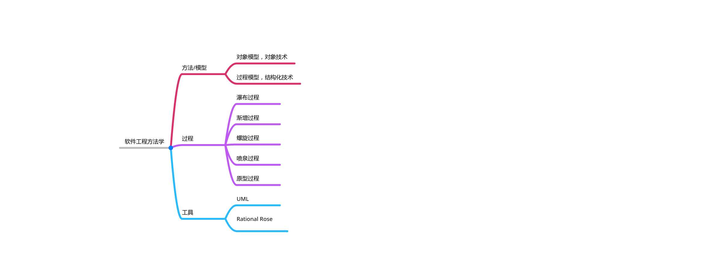

# 计算机软件

> 什么是计算机软件？
计算机软件是程序、数据和相关文档的完整集合。
面向过程程序设计中： 数据结构 + 算法 = 程序
面向对象程序设计中： 对象 + 消息 = 程序

在我们之前的软件学习和开发中，偏重于程序和数据——如 Java 语法课，数据库原理课。吴老师比较有教学经验/远见，在面向对象程序设计和Java Web 开发课程中将 UML 类图，UML 序列图教授我们，但是这些门课程毕竟图不是专门的学习对象，因此学习之中稍有松懈。

如今， UML 建模正是这样的课程，我们需要将过去60-70年中发展起来的软件开发的精髓、“软件工程”的思想用 UML 工具进行表达，也算是对吴老师一年“谆谆教诲”的总结。

# 软件生产方式

类比经济生产方式的发展，我们可以对软件生产方式的发展进行总结：

| 时间 | 特点 | 评语 |
|:--:| :--: | :--: |
|20世纪50--60年代|个体开发，纸带/打孔卡，汇编语言，专门目的||
|20世纪60年代中期--70年代|“软件作坊”，汇编语言，面向过程编程语言（POP），多用户系统、数据库，实时监控系统|1968年，北约计算机科学家就讨论软件危机的问题，提出“软件工程”的概念|
|20世纪70年代--90年代|计算机硬件成本大幅降低（莫尔定律），软件开发逐步结构化、流水化||
|20世纪90年代--现在|面向对象技术，快速原型技术||

# 软件危机

软件危机的表现及软件管理的目的：

1. 开发成本和进度的估计不可预测 （可预测）
2. 用户对软件系统不满意 （可沟通和文档化）
3. 软件质量靠不住 （质量可控和质量管理）
4. 软件系统不可维护 （可维护和发展）
5. 无适当的文档资料 （可追溯）
6. 软件成本占计算机系统总成本不断提高 （可工业化）

# 软件工程

[UML](https://baike.baidu.com/item/%E7%BB%9F%E4%B8%80%E5%BB%BA%E6%A8%A1%E8%AF%AD%E8%A8%80/3160571?fromtitle=UML&fromid=446747&fr=aladdin) 是一种为面向对象系统的产品进行说明、可视化和编制文档的一种标准语言，是非专利的第三代建模和规约语言。UML 是面向对象设计的建模工具，独立于任何具体程序设计语言。

[IBM Rational Rose](https://www.osalt.com/rational-rose) 是来自 IBM 的一系列 UML 产品。每一种产品针对不同的开发者角色或不同的平台/编程语言。对于 MDD （Model-Driven Development），一些版本的该产品支持 C++ ， Java ， J2EE 和 CORBA 的代码生成。为了简化开发，这些版本的产品集成到 IDE 中，如 Borland Jbuilder 和 Microsoft Visual Studio。 其他版本聚焦于数据建模和帮助创建同步于基于此的应用的模型。许多版本的该产品也支持模式和模式的重复使用。（现在比较少的公司在使用已Rose。IBM推出了Rational Software Architect来替代Rational Rose。）

Rational Rose 作为商业的应用，可使用 [StarUML](https://staruml.io/) 作为开源替代品。

# 软件开发方法/模型

- 传统方法学： “自顶向下，逐步求精”

  自顶向下是指通过将一个大问题，逐步细化，得到小问题的一个过程

- 面向对象方法： “自底向上”

